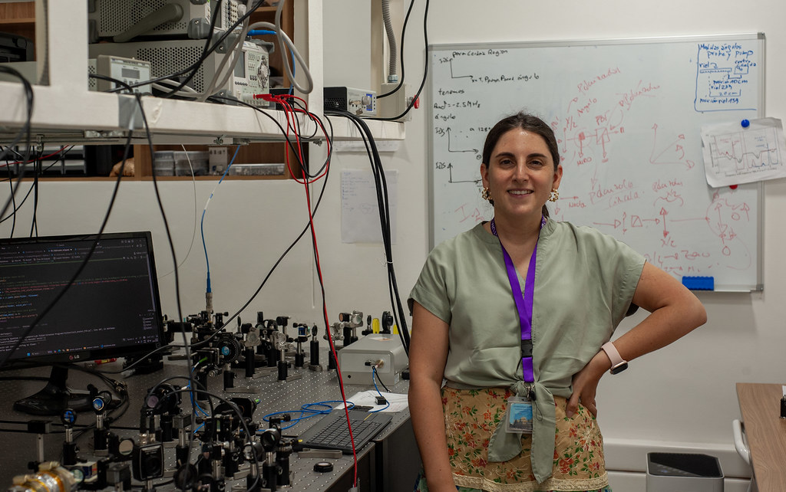
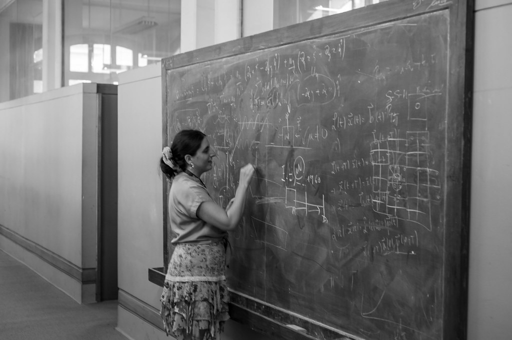
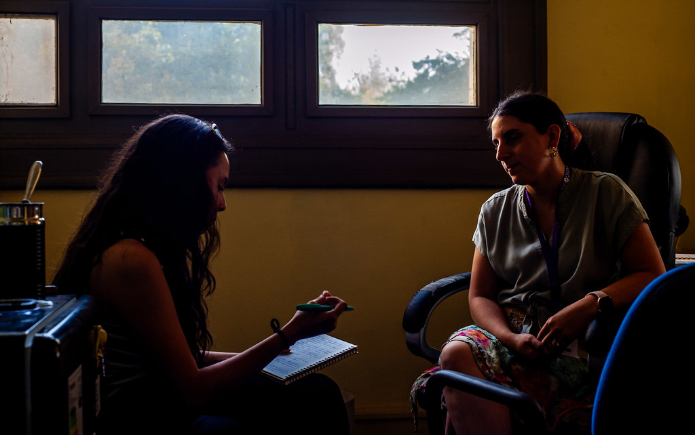

# Luz cuántica y una mirada humana: Entrevista completa a Carla Hermann

**Hoy, en conmemoración del día de la mujer, desde la revista *Futura physica* le damos la bienvenida a una invitada especial: la doctora Carla Hermann, una gran exponente de la física. Es un gusto para la OFTE tenerla con nosotros, profesora.**

¡Hola, hola! ¿Cómo están?

**Muchas gracias de nuevo por esta reunión. Para comenzar, por favor, cuéntenos un poco primero sobre usted y su área de investigación.**

Bueno, yo soy la profesora Carla Hermann, trabajo en la Universidad de Chile, en el Departamento de Física que está asociado a la Facultad de Ingeniería, y también soy investigadora del Instituto Milenio para la Investigación en Óptica (MIRO). Mi *expertise* es la óptica cuántica. Nosotros estudiamos cómo la luz interactúa con la materia a escala atómica y subatómica; nos preocupamos de las fluctuaciones cuánticas, de la luz y de la interacción de los fotones con los átomos, trabajamos en esa escala.

En particular, en mi laboratorio y en mi equipo —porque no solamente hacemos experimentos, sino que también hacemos teoría— nos dedicamos a estudiar la luz que tiene propiedades muy bonitas en un espacio de fase. La particularidad es que posee unas estructuras muy hermosas y además es muy intensa, entonces, nosotros salimos de esa región que normalmente uno asocia a la cuántica, que es el *single photon* o la "única partícula" y el cómo estas dos cosas interactúan y nos vamos a estudiar haces que tienen alguna propiedad cuántica y que están interactuando con un montón de átomos o con algún medio.

En resumen, nos dedicamos a la luz cuántica intensa.

**Y actualmente, ¿está trabajando en algo específico? ¿Tiene planes para este 2026?**

Sí, bueno, tenemos planes de terminar un montón de trabajos que no salieron el año pasado, como siempre. Pero sí, tenemos algunos planes más concretos: queremos tratar de proponer algunas medidas de "no clasicalidad", justamente, de luz intensa. Este es *terreno de nadie* porque la mayoría de las técnicas conocidas están mucho más asociadas a estas partículas individuales y no cuando son muchas. Por lo tanto, parte de lo que queremos hacer este año es desarrollar esas técnicas teóricas, diseñar los experimentos y también realizar algunas cosas en comunicación cuántica, tal vez, si todo sale bien.

Todos los días son súper desafiantes, la verdad, y todos los años lo son.

**Pero igual se escucha súper emocionada. Mi pregunta sería: ¿Qué es lo que más le gusta de esta área?**

Lo que a mí me apasiona es la luz. Para mí, la luz es un revelador del universo a todas las escalas, desde la cosmológica hasta la escala atómica y subatómica. Tengamos en cuenta que descubrimos nuestro mundo por la radiación, por lo que los cuerpos emiten, y también porque podemos observar estas partículas que interactúan con la materia y rescatar imágenes de eso. 

Para mí, la luz es eso: un *revelador del universo*. Mientras entendamos la luz, cómo funciona, cómo es descrita y cómo interactúa con la materia, podemos aprender cosas de nuestro universo, el cual está lleno de luz y radiación por todas partes.

**Y en relación a este encantamiento por la luz y la cuántica, ¿recuerda cuándo descubrió esta pasión por esa área de la física?**

Yo creo que se remonta a mis inicios. Por esta área en particular, recuerdo que fue cuando entré a la Universidad de Concepción — a todo esto, yo soy del sur, estudié allá—. 

En el colegio era muy buena alumna, me encantaba la física y las matemáticas, pero en él nunca vi nada de física moderna; vimos Newton, hidráulica y cosas muy clásicas. Entonces, recuerdo que en el primer año de universidad había un curso llamado "Panorama de la Física", donde te enseñaban de física moderna, pero de forma muy general. Te daban una pincelada por la relatividad especial, general y cuántica.

Y me acuerdo perfecto que cuando empecé a ver relatividad especial y después un poco de cuántica, salí de esa clase con una mezcla entre asombro y una especie de… rabia, como si todo fuera un fraude o un engaño, pues yo *juraba de guata* al salir del colegio que “esto era”. No sé por qué tenía esa visión tan *naive*, pero pensaba que la física era lo que me habían enseñado y ya… y que después todo era solamente más aplicado y la dificultad radicaba en entenderlo todo mejor, pero en esa época yo no tenía en mi cabeza la idea de que había más… de que había todo un mundo adicional.

Así, cuando entré a la universidad y me presentaron este curso, fue como: "¡¿Qué es esto?!" o sea… “¡Me engañaron!”. Fue toda una mezcla de emociones; sí, fue un asombro, pero también como si se me hubiera caído un velo. Entendí de repente que había tanto más, y esa cuestión fue asombrosa y muy bonita.

**Sabemos que usted estuvo trabajando fuera de Chile porque hizo un doctorado afuera. En este largo camino que ha recorrido y su experiencia trabajando en laboratorios de alto nivel, ¿qué significa para usted volver a Chile a hacer física?**

La verdad, cuando me fui del país siempre pensé en volver. Nunca me fui con la expectativa de hacer carrera fuera, pues siempre tuve la visión de Carlos Saavedra, el actual rector de la universidad de Concepción. Yo fui alumna de él y tenía esta idea de: *"anda fuera, aprende y vuelve"*. Entonces, siempre me fui con esa intención: quería ir, aprender, volver y potenciar la ciencia en esta región del mundo. Me fui unos cinco años a Francia y después dos años a Estados Unidos. Volví como a los siete años y… fue genial porque, efectivamente, aprendí cosas que acá no nos enseñaban, pues todavía no teníamos herramientas, ni de personal ni de experimentos. 

Al volver, regresé con un montón de herramientas nuevas y eso hizo que fuera —a mi juicio—, tal vez, más fácil inyectarme en un lugar, porque estaba proponiendo líneas de investigación nuevas que no se hacían en Chile. Eso fue un buen potencial y, desde estas áreas nuevas, es donde uno empieza a formar más alumnos y alumnas. Así empezamos con este círculo: voy generando nuevo conocimiento, pero al mismo tiempo voy capacitando a la gente que está en Chile y… Espero que en algún momento ellos también se vayan afuera, aprendan y ojalá también quieran volver. 

**Claro, y al final la ciencia en Chile se está posicionando mejor gracias a personas que —como usted— han traído conocimiento de frontera. Dado esto, considerando su reconocida carrera y en el marco del 8 de marzo, ¿Qué significa para usted ser un referente para estudiantes y mujeres que están entrando a la física?**

Para mí significa, primero, una gran responsabilidad, porque creo que estos referentes tienen que ser referentes reales. No creo en esos referentes que están llenos de éxito y donde uno ve solo los triunfos,  porque una persona no se hace por sus éxitos, se hace normalmente por los fracasos y por lo que ha tenido que sobrepasar para llegar donde está. 

Desde ese punto de vista, he tratado de asumir este rol de referente —aunque no lo planeé así— desde un lugar de vulnerabilidad.

Trato de mostrar a los estudiantes que las cosas no son color de rosas y que requieren mucho esfuerzo y trabajo duro, pero también ser estratégico. Es vital trabajar en grupos sanos donde tengan un límite entre la vida personal y laboral.

También siempre les cuento, y esto no es un secreto, todos los problemas de salud mental que yo he tenido, porque sé que muchos se ven reflejados en eso. Así pueden decir: "¡Uy! Entonces no soy un fracasado porque esto me pasa; a la profe Carla también le pasó". Ese tipo de cosas vuelven a este referente algo real *¿cachai?*, porque si uno pone referentes perfectos, solo llenos de éxito y que todo les sale bien, es natural pensar que ese referente no es alcanzable y decir “es que yo no hago todo bien, yo fallo en estas cosas, es que me he terapeado los últimos 15 años…” lo que sea.

Entonces cuando uno ve a esta persona que se transforma en referente, que tal vez ya está en una posición más alta en la academia y se sabe que ha pasado por cosas así… cuando se ve todo ese espectro de la persona completa, yo creo que ahí se alcanza este ideal de tener un referente que verdaderamente es una referencia en la vida real, sin tener que sacrificarlo todo y en donde lo único que haces bien es esto… Yo trato de ser una buena mamá, de estar presente con mis hijos, de hacer investigación, divulgación, tener un equipo sano e invitarlos a la casa a asados, etc… y por lo tanto, pasa que muchas veces andamos más lento, porque no tenemos tiempo para todo; al final el día solo tiene 24 horas.

De este modo, esta posición de referente ha hecho dos cosas: 

Primero, siento que estoy abriendo caminos y sé que, en particular por el 8M, hay niñas y mujeres que se van a atrever a desarrollarse en ciencia y decir “yo también puedo hacer esto”, “qué entretenido lo que hace la profe Carla y, mira, también puedo tener una familia y ser exitosa… voy a seguir”. 

En segundo lugar, también me veo como una persona que está redefiniendo lo que significa el éxito. Porque no es solo un índice Hirsch, ni el *paper* publicado, para mí, la excelencia académica tiene mucho que ver con la formación de estudiantes que estén disfrutando lo que hacen mientras trabajan duro, porque no hay forma de lograr cosas sin trabajo duro. Pero busco que sea sin abusos, algo más colaborativo, no tan jerárquico…

**Y sin perder la vida.**

¡Por supuesto! Es que yo insisto: todos trabajamos duro. Todos vamos a tener períodos en los que tal vez tienes que quedarte toda la noche en el laboratorio midiendo, y *“ok”*, todos lo hicimos. Pero eso no puede ser sacrificando toda tu vida para hacer ciencia, porque lo que puede pasar ahí es que termines en depresión o con esas ganas de "no quiero seguir este camino porque no puedo hacer nada", “los únicos referentes que tengo tuvieron que sacrificarlo todo y… yo no quiero eso. Yo quiero hacer deporte, quiero tener familia, amigos.” Ahí está esta falsa disyuntiva que en el fondo es… o tengo una vida íntegra o me dedico solo a esto. Eso no es real y estoy tratando de romperlo, aunque obviamente voy más lento. 

**Relacionado con esto, ¿les daría algún consejo a estas mujeres y en general a estos estudiantes que quieren empezar en el camino de la física?**

Hablando primero hacia mujeres y niñas en ciencia, creo que, dadas ciertas construcciones sociales que estamos tratando de cambiar culturalmente, todavía se ven efectos de crianzas donde se nos ha inculcado más una labor de servicio y no necesariamente de construcción de nuevo conocimiento o de ser líderes. Desde esa perspectiva, les diría que se atrevan a soñar en grande, que no se queden estancadas en esa estructura social impuesta. Y quiero ser súper clara: si para algunas es su decisión de vida, *bacán*, pero que sea una decisión y no algo forzado por la cultura o porque pensaste que eras solo buena para ciertas tareas. Atrévanse a soñar y de repente puede que les dé miedo, pero nada, a veces hay que avanzar con miedo, y hay que avanzar nomás, sí, con miedo, pero avanzar.

Y en general a los estudiantes... creo que para seguir una carrera científica tienes que tener pasión por lo que estás investigando. Pasión por la ciencia, por entender el mundo, el universo y hacerse preguntas incómodas. Si no está esa pasión, es complejo y te diría piénsalo 2 veces, porque la mayor parte del tiempo para un científico o una científica, son puros “no”: no funciona, no funciona, no funciona, no funciona… hasta que eventualmente algo sale bien y *sacai un paper* bonito y qué sé yo… pero hay muchas etapas previas de frustración, porque en general son problemas en que estás expandiendo el horizonte de conocimiento, por tanto no siempre sabes la respuesta correcta. 

Por eso hay que tener esta pasión para disfrutar tanto el camino como la meta. Que el hacer ciencia no sea solamente el reconocimiento, sino que sea el explorar y el cuestionar, eso es vital para sobrellevar lo que viene. 

**Usted mencionó que para la mujer hay muchos estereotipos y sesgos. ¿Cree que podrían existir prácticas simples que se puedan adoptar en universidades o grupos como la OFTE para apoyar a mujeres en STEM?**

Esta es una pregunta compleja, porque a mi juicio este problema no aparece en la universidad; en ella estamos tratando de arreglar un problema que ya viene por años, entonces es bien complicado a veces tratar de solucionarlo. De hecho, yo creo que a esta altura son más bien soluciones parches a algo que ya viene, pero es difícil cambiarlo. Yo creo que donde realmente uno puede hacer el cambio es en la niñez temprana, de los cero a los siete años; ahí creo que está la clave de todo.

Fuera de eso, supongamos que ya venimos con la cultura interna y que ya tenemos esta estructura de pensamiento tal vez más servicial, menos empoderada, menos líder y más "calladita". No todas son así, tampoco me malinterpreten —yo nunca fui así—, pero sí, cuando uno ve ciertas estructuras culturales se tiende a ver más este tipo de comportamiento. Creo que en la universidad, donde más se puede ayudar es en el trato.

En particular, yo nunca me sentí discriminada; mis profesores me trataban igual. Jamás sentí que me pidieran un cálculo más fácil que a mi compañero, o que mi opinión valiera menos en una discusión donde a otro estudiante se le escuchaba más diciendo lo mismo. Sin embargo, sé que mucha gente sí vive estas situaciones donde el profesor intenta "ayudar" inconscientemente debido a micromachismos. Dicen: "No, yo te ayudo", y una se pregunta: "¿Por qué? Si solo quiero que me trates y me escuches igual que a mis compañeros".

A mí una vez una persona en redes sociales me dijo que esto era del siglo XIV, que ya no ocurre y que ya no hay brechas de género. Yo le respondí: "Loco, anda a una juguetería; todavía ves secciones de juguetes de niñas y de niños". Esto mismo pasa, digamos, con niños y niñas más grandes: siguen existiendo sesgos que muchas veces son micromachismos y, por lo tanto, cuesta más identificar.

Por ejemplo, en los cursos se puede empujar que en las bibliografías, en los *papers* y libros se integren a mujeres. Hay mujeres que hacen buena ciencia en cualquier área. Es tratar de esforzarse un poquito más y decir: "Ya, este loco es seco, pero esta vez voy a potenciar los trabajos de estas investigadoras para que los alumnos los estudien". Yo creo que ese tipo de pasitos pueden ayudar a la sensación de que esta cuestión es un poco más equitativa y que podemos alcanzar la equidad en ciencia.

La UNESCO tiene una frase muy bonita que dice: *"El mundo necesita ciencia y la ciencia necesita mujeres"* y hablan justamente de esto, que la ciencia se beneficia de miradas diversas y nosotras somos la mitad de la población del mundo; por lo tanto, desde nuestra perspectiva podemos aportar a hacer una mejor ciencia, una más integral.

**Muchas gracias y, por último, profesora... Si pudiera con un par de palabras describir el rol de la mujer en la ciencia, complete la frase: "ser mujer en física hoy significa..."**

¡Ser *bacán*! [risas] No, no, mira, diría que… ser mujer en física hoy significa explorar el universo con otros ojos, eso creo yo.

